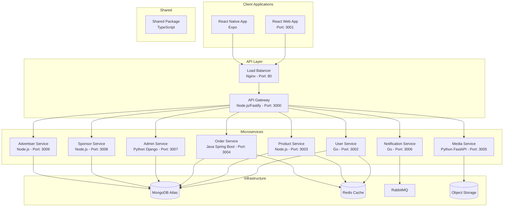
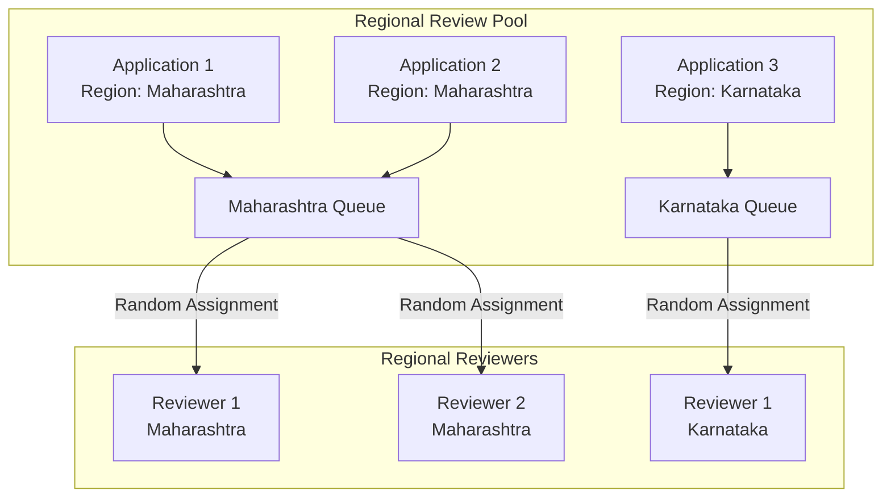

# Design Document

## Overview

This design document outlines the complete boilerplate setup for the Community-Driven E-Commerce Platform. The design focuses on creating a polyglot microservices architecture where each service uses the optimal technology stack for its specific requirements, while maintaining consistent development workflows and deployment strategies. The platform will support both web and mobile clients with shared business logic and APIs.

## Architecture

### High-Level Architecture



### Technology Stack Selection

| Service | Technology | Rationale |
|---------|------------|-----------|
| **API Gateway** | Node.js + Fastify | High-performance async I/O, excellent for routing and proxying |
| **User Service** | Go + Gin | Memory efficient, excellent concurrency for auth operations |
| **Product Service** | Node.js + Express | Fast development, good for JSON APIs and search operations |
| **Order Service** | Java Spring Boot | Robust transaction handling, enterprise-grade reliability |
| **Media Service** | Python + FastAPI | Rich ecosystem for image processing (OpenCV, PIL) and ML libraries |
| **Notification Service** | Go + Gin | High concurrency for handling message queues and notifications |
| **Admin Service** | Python + Django | Rapid admin panel development with built-in ORM and admin interface |
| **Sponsor Service** | Node.js + Express | Simple CRUD operations, fast development |
| **Advertiser Service** | Node.js + Express | Simple CRUD operations, consistent with sponsor service |
| **Web Frontend** | React + TypeScript + Material UI | Modern, type-safe, component-rich UI development |
| **Mobile App** | React Native + Expo | Cross-platform development with native capabilities |

## Components and Interfaces

### Project Structure

```
community-driven-project/
├── services/
│   ├── api-gateway/           # Node.js + Fastify
│   │   ├── src/
│   │   │   ├── routes/
│   │   │   ├── middleware/
│   │   │   ├── config/
│   │   │   └── utils/
│   │   ├── tests/
│   │   ├── package.json
│   │   ├── Dockerfile
│   │   └── README.md
│   ├── user-service/          # Go + Gin
│   │   ├── cmd/
│   │   ├── internal/
│   │   │   ├── handlers/
│   │   │   ├── models/
│   │   │   ├── services/
│   │   │   └── repository/
│   │   ├── tests/
│   │   ├── go.mod
│   │   ├── Dockerfile
│   │   └── README.md
│   ├── product-service/       # Node.js + Express
│   ├── order-service/         # Java Spring Boot
│   │   ├── src/main/java/
│   │   ├── src/test/java/
│   │   ├── pom.xml
│   │   ├── Dockerfile
│   │   └── README.md
│   ├── media-service/         # Python + FastAPI
│   │   ├── app/
│   │   │   ├── api/
│   │   │   ├── models/
│   │   │   ├── services/
│   │   │   └── utils/
│   │   ├── tests/
│   │   ├── requirements.txt
│   │   ├── Dockerfile
│   │   └── README.md
│   ├── notification-service/  # Go + Gin
│   ├── admin-service/         # Python + Django
│   │   ├── admin_service/
│   │   ├── apps/
│   │   ├── tests/
│   │   ├── requirements.txt
│   │   ├── manage.py
│   │   ├── Dockerfile
│   │   └── README.md
│   ├── sponsor-service/       # Node.js + Express
│   └── advertiser-service/    # Node.js + Express
├── clients/
│   ├── web/                   # React + TypeScript
│   │   ├── src/
│   │   │   ├── components/
│   │   │   ├── pages/
│   │   │   ├── services/
│   │   │   ├── store/
│   │   │   ├── hooks/
│   │   │   ├── utils/
│   │   │   └── types/
│   │   ├── public/
│   │   ├── tests/
│   │   ├── package.json
│   │   ├── Dockerfile
│   │   └── README.md
│   └── mobile/                # React Native + Expo
│       ├── src/
│       │   ├── screens/
│       │   ├── components/
│       │   ├── navigation/
│       │   ├── services/
│       │   ├── store/
│       │   └── utils/
│       ├── assets/
│       ├── tests/
│       ├── package.json
│       ├── app.json
│       └── README.md
├── shared/                    # TypeScript shared package
│   ├── src/
│   │   ├── types/
│   │   ├── utils/
│   │   ├── constants/
│   │   └── validators/
│   ├── tests/
│   ├── package.json
│   └── README.md
├── infrastructure/
│   ├── docker/
│   ├── kubernetes/
│   ├── nginx/
│   └── monitoring/
├── scripts/
│   ├── setup.sh
│   ├── build.sh
│   └── deploy.sh
├── docs/
│   ├── api/
│   ├── architecture/
│   └── deployment/
├── .github/
│   ├── workflows/
│   └── ISSUE_TEMPLATE/
├── docker-compose.yml
├── docker-compose.prod.yml
├── package.json               # Root orchestration
└── README.md
```

### API Gateway Design

The API Gateway will serve as the single entry point for all client requests:

- **Routing**: Route requests to appropriate microservices based on URL patterns
- **Authentication**: Validate JWT tokens and forward user context
- **Rate Limiting**: Implement per-user and per-endpoint rate limiting
- **Load Balancing**: Distribute requests across service instances
- **Request/Response Transformation**: Handle API versioning and response formatting
- **Monitoring**: Log all requests and collect metrics

### Service Communication

- **Synchronous**: HTTP/REST for real-time operations
- **Asynchronous**: RabbitMQ for event-driven communication
- **Service Discovery**: Docker Compose networking for development, Kubernetes services for production

### Database Strategy

- **MongoDB**: Primary database for most services (User, Product, Order, Admin, Sponsor, Advertiser)
- **Redis**: Caching layer and session storage
- **Object Storage**: AWS S3 or compatible for media files

## Data Models

### Shared Types (TypeScript)

```typescript
// User types
interface User {
  id: string;
  email: string;
  profile: UserProfile;
  roles: UserRole[];
  status: UserStatus;
  region: Region;
  createdAt: Date;
  updatedAt: Date;
}

interface UserProfile {
  firstName: string;
  lastName: string;
  avatar?: string;
  phone?: string;
  address?: Address;
}

// Regional types
interface Region {
  country: string;
  state: string;
  city?: string;
  coordinates?: Coordinates;
}

interface Coordinates {
  latitude: number;
  longitude: number;
}

interface Address {
  street: string;
  city: string;
  state: string;
  country: string;
  postalCode: string;
  coordinates?: Coordinates;
}

// Product types
interface Product {
  id: string;
  title: string;
  description: string;
  category: ProductCategory;
  condition: ProductCondition;
  images: string[];
  tags: string[];
  inNeedOnly: boolean;
  giverId: string;
  status: ProductStatus;
  region: Region;
  location: Address;
  // Future warehouse inspection fields
  inspectionStatus?: InspectionStatus;
  warehouseId?: string;
  inspectionNotes?: string;
  createdAt: Date;
  updatedAt: Date;
}

// Order/Claim types
interface Claim {
  id: string;
  productId: string;
  claimerId: string;
  giverId: string;
  status: ClaimStatus;
  deliveryMethod: DeliveryMethod;
  deliveryAddress?: Address;
  notes?: string;
  createdAt: Date;
  updatedAt: Date;
}

// Common enums
enum UserRole {
  GIVER = 'giver',
  TAKER = 'taker',
  REVIEWER = 'reviewer',
  ADMIN = 'admin',
  SPONSOR = 'sponsor',
  ADVERTISER = 'advertiser'
}

enum ProductStatus {
  AVAILABLE = 'available',
  CLAIMED = 'claimed',
  IN_TRANSIT = 'in_transit',
  RECEIVED = 'received',
  CANCELLED = 'cancelled'
}

enum ClaimStatus {
  PENDING = 'pending',
  APPROVED = 'approved',
  IN_TRANSIT = 'in_transit',
  DELIVERED = 'delivered',
  CANCELLED = 'cancelled'
}

// Future warehouse inspection enums
enum InspectionStatus {
  PENDING = 'pending',
  IN_PROGRESS = 'in_progress',
  APPROVED = 'approved',
  REJECTED = 'rejected',
  REQUIRES_REVIEW = 'requires_review'
}

enum DeliveryMethod {
  PICKUP = 'pickup',
  DELIVERY = 'delivery',
  WAREHOUSE_PICKUP = 'warehouse_pickup'
}
```

### Service-Specific Models

Each service will have its own data models optimized for its specific use case:

- **User Service**: Authentication, profiles, roles, mandatory regional information, "in need" applications
- **Product Service**: Product catalog with regional partitioning, categories, region-restricted search indexes
- **Order Service**: Claims with regional validation, delivery tracking, transaction history
- **Media Service**: File metadata, processing status, blur operations
- **Notification Service**: Message templates, delivery status, regional preferences
- **Admin Service**: Regional audit logs, region-specific moderation actions, system settings

### Regional Architecture Strategy

To minimize operational costs, the platform enforces strict regional boundaries:

1. **Mandatory Regional Registration**: Users must provide and verify their state/region during registration
2. **Regional Data Partitioning**: Database collections are partitioned by region to prevent cross-regional queries
3. **Regional API Enforcement**: All API endpoints validate and enforce regional restrictions
4. **Cost Optimization**: By limiting interactions to same-region users, we reduce:
   - Shipping/delivery costs
   - Logistics complexity
   - Regional compliance requirements
   - Support overhead

### Regional Review System Design

The "in need" application review system implements a fair, unbiased regional job pool:

1. **Regional Job Pool**: All "in need" applications are queued by region in a centralized pool
2. **Random Assignment**: Applications are randomly assigned to available reviewers within the same region
3. **Anonymized Reviews**: Reviewers see only blurred media and anonymized application data
4. **Language Compatibility**: Regional assignment ensures reviewers can understand local languages
5. **Bias Prevention**: Random assignment prevents reviewers from selecting specific applicants
6. **Performance Tracking**: System tracks reviewer accuracy and response times
7. **Admin Oversight**: Regional admins can monitor review quality and reassign if needed



## Error Handling

### Standardized Error Response

```typescript
interface ApiError {
  code: string;
  message: string;
  details?: any;
  timestamp: string;
  requestId: string;
}
```

### Error Categories

- **Validation Errors** (400): Invalid input data
- **Authentication Errors** (401): Invalid or missing credentials
- **Authorization Errors** (403): Insufficient permissions
- **Not Found Errors** (404): Resource not found
- **Conflict Errors** (409): Resource already exists or state conflict
- **Server Errors** (500): Internal service errors

### Error Handling Strategy

1. **Service Level**: Each service handles its own errors and returns standardized responses
2. **Gateway Level**: API Gateway catches and transforms errors for consistent client experience
3. **Client Level**: Clients handle errors gracefully with user-friendly messages
4. **Monitoring**: All errors are logged and monitored for system health

## Testing Strategy

### Testing Pyramid

1. **Unit Tests** (70%): Test individual functions and components
2. **Integration Tests** (20%): Test service interactions and database operations
3. **End-to-End Tests** (10%): Test complete user workflows

### Testing Tools by Technology

- **Node.js**: Jest + Supertest for API testing
- **Go**: Built-in testing package + Testify for assertions
- **Java**: JUnit 5 + Mockito for mocking
- **Python**: Pytest + FastAPI TestClient
- **React**: Jest + React Testing Library
- **React Native**: Jest + React Native Testing Library

### Testing Infrastructure

- **Test Databases**: Separate test instances for each service
- **Mock Services**: Mock external dependencies during testing
- **CI/CD Integration**: Automated testing on every pull request
- **Coverage Reports**: Maintain >80% code coverage across all services

### Development Workflow

1. **Local Development**: Docker Compose for running all services locally
2. **Hot Reloading**: Each service configured for development mode with auto-restart
3. **Debugging**: Debug configurations for each technology stack
4. **API Documentation**: OpenAPI/Swagger for each service
5. **Code Quality**: Automated linting, formatting, and type checking

This design provides a solid foundation for community contributors to start building features immediately while maintaining high code quality and consistent development practices across different technology stacks.